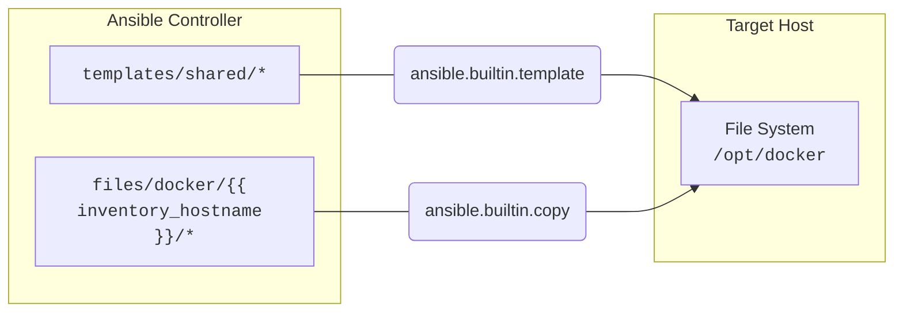

# Docker Compose Role for Ansible


This role installs **Docker Compose** and configures an **application stack** for a list of hosts.

The following steps are supported:
* Distribute shared files like `docker-compose.yml` by using the template function.
* Distribute encrypted secrets through an `.env` file.
* Distribute files and folders for a mapped volume.

**Secrets** *(.env)*, **files and folders** *(data volume)* can be <u>configured individually for each host</u>. Only the files in the template folder like `docker-compose.yml.j2` are shared between all hosts.

## Variables

Default variables in this playbook.

| Name                             | Description                                                                                                                                   | Default Value                           |
| -------------------------------- | --------------------------------------------------------------------------------------------------------------------------------------------- | --------------------------------------- |
| docker_compose_environment       | The local directory where `.env` and other host specific files are located.                                                                   | `files/docker/{{ inventory_hostname }}` |
| docker_compose_templates         | The local directory where `docker-compose.yml.j2` and other shared templates are located.                                                     | `templates/shared`                      |
| docker_compose_destination       | The remote directory where shared and host specific files are copied to.                                                                      | `/opt/docker`                           |
| docker_compose_permissions       | The permissions of the copied files on the target system.                                                                                     | `0644`                                  |
| docker_compose_nocache           | Enable this option to ignore the image cache when performing the build.                                                                       | `false`                                 |
| docker_compose_remove_orphans    | Removes containers that were created in a previous run of `docker-compose up` but have since been deleted from the `docker-compose.yml` file. | `true`                                  |
| docker_compose_restart_on_change | Restarting Docker containers after a change to templates or files.                                                                            | `true`                                  |
| docker_compose_login             | Specifies whether to perform a Docker Registry login.                                                                                         | `false`                                 |
| docker_compose_registry          | Url for a public or private Docker Registry.                                                                                                  | `https://registry-1.docker.io/v2/`      |
| docker_compose_username          | Username for the Docker Registry.                                                                                                             | ` `                                     |
| docker_compose_password          | Password for the Docker Registry.                                                                                                             | ` `                                     |

## How it works

With the default options, the following steps are performed:

1. Templates from the `templates/shared` folder are copied to `/opt/docker`. The file extension .j2 is removed.
2. Files from the `files/docker/{{ inventory_hostname }}/` folder are copied to `/opt/docker`. Files encrypted with ansible-vault can be used here.
3. Checking if a login should be performed at a Docker registry.
4. Docker Compose is used to build/launch the application stack.

After execution, the two variables `docker_login` and `docker_compose` can be accessed, which contain additional status information.



## Example

Here are example of how this role can be used.

In this example, a web server is deployed using Docker. It distributes host-specific environment variables and a web page.

Your playbook can look like this:


Content of the `main.yml` file:
```yaml
---
- name: Example
  hosts: all
  roles:
    - role: bec.docker.docker_ce
    - role: bec.docker.docker_compose
  tasks:
    - name: Output information about the Docker login step
      when: docker_login is defined
      ansible.builtin.debug:
        var: docker_login

    - name: Output information about the Docker compose step
      when: docker_compose is defined
      ansible.builtin.debug:
        var: docker_compose
```

> The Docker_CE role can be replaced with your own if the Docker community version is not preferred.

Content of the `docker-compose.yml.j2` file:
```yaml
version: '3.9'
services:
  nginx:
    container_name: nginx
    image: nginx
    restart: unless-stopped
    volumes:
      - /opt/docker/data:/usr/share/nginx/html:ro
    ports:
      - 80:${NGINX_PORT}/tcp
```

Content of the `.env` file:
```shell
NGINX_PORT=80
```

Docker Compose takes the environment variables from the `.env` file and puts them into `docker-compose.yml.j2` - this allows a host specific configuration.

You can test the output yourself with the `docker compose config` command.

If a **shared template** should be used for the website, this can be implemented in this way:

All files in the template folder `shared` are copied to the target systems.